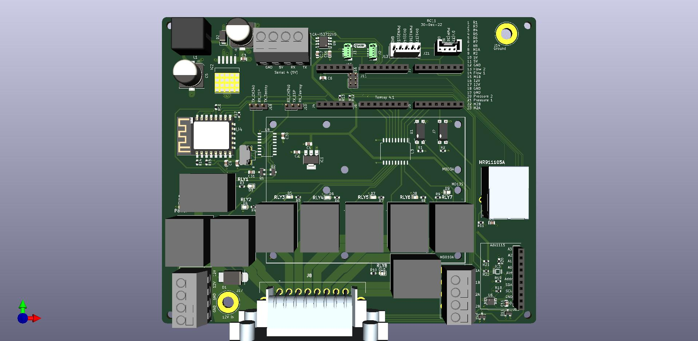

### [Nano RC12-2](Nano/RC12-2)
- uses a Nano (with ENC28J60 Ethernet shield) & an on-board mounted Cytron for rate control
	- either (1) [MD13S](https://www.cytron.io/p-13amp-6v-30v-dc-motor-driver) for single rate control
 	- or (1) [MD10C](https://www.cytron.io/c-motor-and-motor-driver/c-motor-driver/p-10amp-5v-30v-dc-motor-driver) for single rate control
- self assembled through-hole board, least expensive
- controls one rate
- can be connected to a relay module with another small pcb
- [OSHPARK](https://oshpark.com/shared_projects/UU8e90h9)

#
### [Teensy 4.1 RC11](Teensy/RC11_PCB)
- uses a Teensy & an on-board mounted Cytron for rate control
	- either (1) [MD13S](https://www.cytron.io/p-13amp-6v-30v-dc-motor-driver) for single rate control
 	- or (1) [MDD10A](https://www.cytron.io/p-10amp-5v-30v-dc-motor-driver-2-channels) for dual rate control
- small components are surface mount parts
- Teensy Ethernet or ESP8266 (ESP-12F) Wifi
- can control two rates and eight sections
	- 8 relays (SPST 12V output)
	- (2) 5V analog (pressure) inputs
	- (2) optically isolated digital (rate/pulse) inputs (5V)
- 5V Serial TTL header
- 3.3V I2C headers
	- supports optional external RelayDriver5 I2C board

#
### [ESP32 RC15](ESP32/RC15)
- uses an ESP32 (optional W5500 Ethernet Module)
- mostly surface mount parts
- can control two rates and 7-14 sections
	- (2) DRV8870 motor drivers with reversible outputs for rates
	- (7) DRV8870 motor drivers for either 7 reversible (motorized ball valve) outputs or 14 single ended (high or low) section outputs
- (4) 5V analog inputs (or 2 differential inputs)
- (2) optically isolated digital (rate/pulse) inputs, up to 12V
- RS485 chip & header
- 3.3V I2C header
	- supports optional external RelayDriver5 I2C board

#
### [RelayDriver5](RelayDriver5)
- PCA9535 based I2C IO expander
- designed to plug into 8 or 16 channel relay board with Qwiic cable

